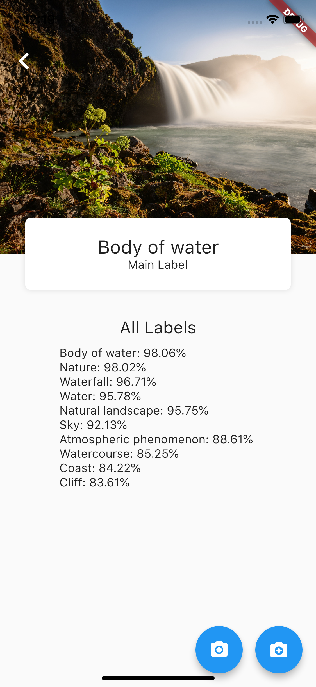
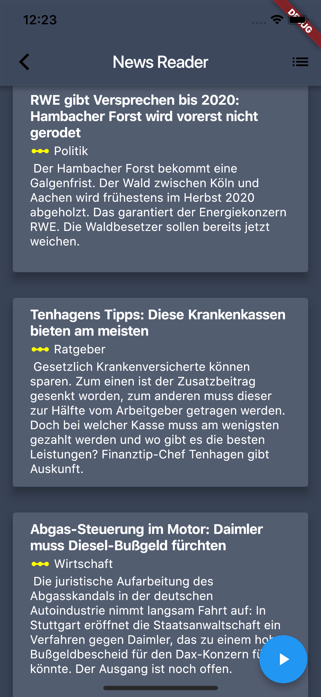

# Flutter playground

A playground for analysing and testing Flutter and Cloud Machine Learning Services. Currently consists of a General Vision app, which detects general labels in the provided image (using Google's Cloud Vision API) and a News Reader, which fetches latest news, converts them to speech (using Google's Text-To-Speech API) and reads them for you.

## Screenshots

|            General Vision API            |             News Reader              |
| :--------------------------------------: | :----------------------------------: |
|  |  |
